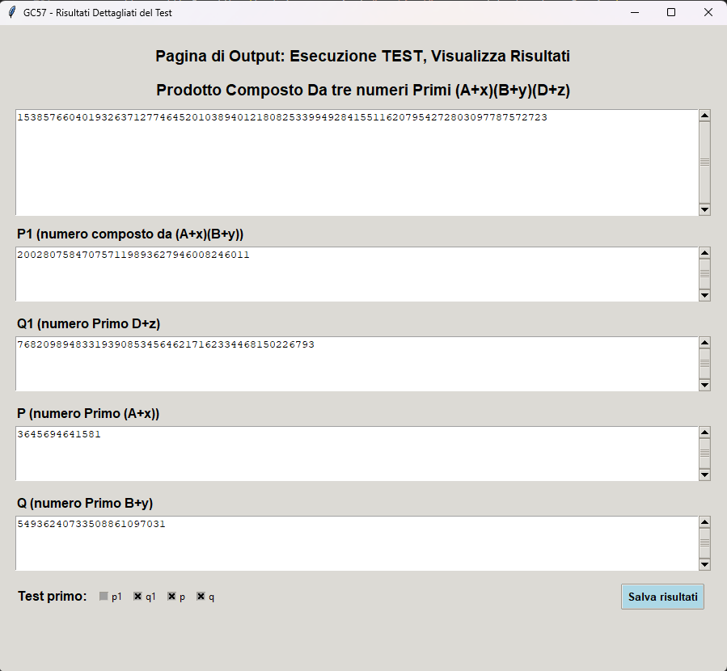
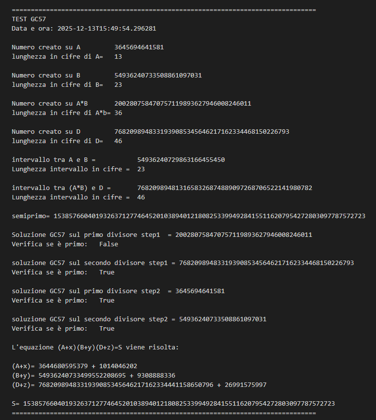

# GC57-Cubic-Test

Experimental tool for analyzing a factor reconstruction method based on a cubic equation

# GC57 – Strumento di Test per Fattorizzazione tramite Equazione Cubica

## Descrizione generale

**GC57** è un programma sperimentale sviluppato per analizzare un metodo di
ricostruzione dei fattori di un semiprimo a partire dalla risoluzione
dell’equazione:

\[
(A + x)(B + y)(D + z) = S
\]

dove:
- **A**, **B**, **D** sono valori di base scelti dall’utente (con numero di cifre controllato),
- **x**, **y**, **z** sono scostamenti interi selezionati dal computer,
- **S** è il prodotto risultante utilizzato come semiprimo di test.

Il programma ha finalità **sperimentali e dimostrative** e non è destinato a
impieghi crittografici o produttivi.

---

## Generazione del prodotto di test

Nella fase di generazione, il programma **non calcola direttamente**:

$[ S = A \cdot B \cdot D ]$

bensì genera un prodotto della forma:

\[
S = (A + x)(B + y)(D + z)
\]

dove:
- gli scostamenti **x**, **y**, **z** sono scelti dal computer
- vengono selezionati **all’interno di intervalli controllati**
- **non sono mostrati all’utente** durante la fase di test

Il prodotto **S** viene quindi trattato come **semiprimo noto**, mentre
l’algoritmo di risoluzione opera **senza conoscere esplicitamente**
i valori di \(x\), \(y\), \(z\).

La risoluzione avviene basandosi esclusivamente su:
- i valori estratti da **B** e **D** che sono le rispettive chiavi Cb e Cd
- il semiprimo **S**

I valori di \(x\), \(y\), \(z\) vengono ricostruiti **solo a posteriori** e
resi visibili esclusivamente nel file di report finale (.txt), a scopo di
verifica.

---

## Interfaccia del programma

### 1️⃣ Finestra principale – Impostazione e generazione


Da questa schermata è possibile:
- impostare il numero di cifre per **A**, **B**, **D**
- generare i valori di partenza
- avviare la creazione del prodotto **S**
- eseguire il test di risoluzione

---

### 2️⃣ Finestra risultati



Durante il test il programma:
- ricerca numeri primi coerenti all’interno degli intervalli determinati
- verifica la primalità dei divisori intermedi
- tenta la ricostruzione dei fattori in due step successivi

Se il test non va a buon fine, viene mostrato un **avviso esplicativo**
che chiarisce che il fallimento:
- **non è un errore del programma**
- è dovuto ai limiti dell’intervallo o alla scelta dei parametri

---

## Risoluzione dell’equazione cubica

Il metodo procede per passi:

### Step 1 – Ricerca dei divisori intermedi
Vengono cercati fattori compatibili con i vincoli aritmetici e con
gli intervalli selezionati.  
È previsto che alcuni risultati **non siano primi**.

### Step 2 – Ricostruzione dei fattori
Dai divisori intermedi si risale ai valori originali **A**, **B**, **D**,
calcolando gli scostamenti:
- \( x = A_{\text{ricostruito}} - A \)
- \( y = B_{\text{ricostruito}} - B \)
- \( z = D_{\text{ricostruito}} - D \)

### Verifica finale
Il programma verifica che:

\[
(A + x)(B + y)(D + z) = S
\]

---

## Output dei risultati

### 3️⃣ File di report (.txt)



Su richiesta dell’utente, il programma genera un file di testo contenente:
- parametri iniziali
- lunghezze in cifre
- intervalli di ricerca
- risultati dei test di primalità
- ricostruzione completa dell’equazione

Il formato TXT è stato scelto per:
- leggibilità umana
- confronto tra test diversi
- archiviazione a lungo termine

---

## Avvisi importanti

- Il fallimento di un test **non implica un errore logico**.
- Le cause più comuni sono:
  - intervallo di ricerca troppo piccolo
  - valore **A** troppo piccolo rispetto a **B**
  - scelta casuale che cade vicino ai limiti dell’intervallo
- Ripetere il test con gli stessi parametri può produrre esiti diversi.

---

## Riferimenti esterni

Per una descrizione più approfondita del metodo e del contesto teorico,
si rimanda ai documenti pubblicati su Zenodo:

- Documento principale:  
  https://zenodo.org/records/17912853

- Contesto introduttivo e pubblicazione più ampia:  
  https://zenodo.org/records/15640331

---

## Stato del progetto

Questo progetto è:
- sperimentale
- orientato all’osservazione e all’analisi
- privo di pretese accademiche o crittografiche

Contributi, osservazioni e analisi critiche sono benvenuti.

---

## Requisiti

- Python 3.x  
- Tkinter (incluso nella maggior parte delle distribuzioni Python)
- gmpy2 (libreria esterna per l’aritmetica a precisione multipla)

Installazione di gmpy2:

```bash
pip install gmpy2
```
---

## Licenza

MIT License

Copyright (c) 2025

Permission is hereby granted, free of charge, to any person obtaining a copy
of this software and associated documentation files (the "Software"), to deal
in the Software without restriction, including without limitation the rights
to use, copy, modify, merge, publish, distribute, sublicense, and/or sell
copies of the Software, and to permit persons to whom the Software is
furnished to do so, subject to the following conditions:

[ testo MIT standard completo nel file LICENSE ]

