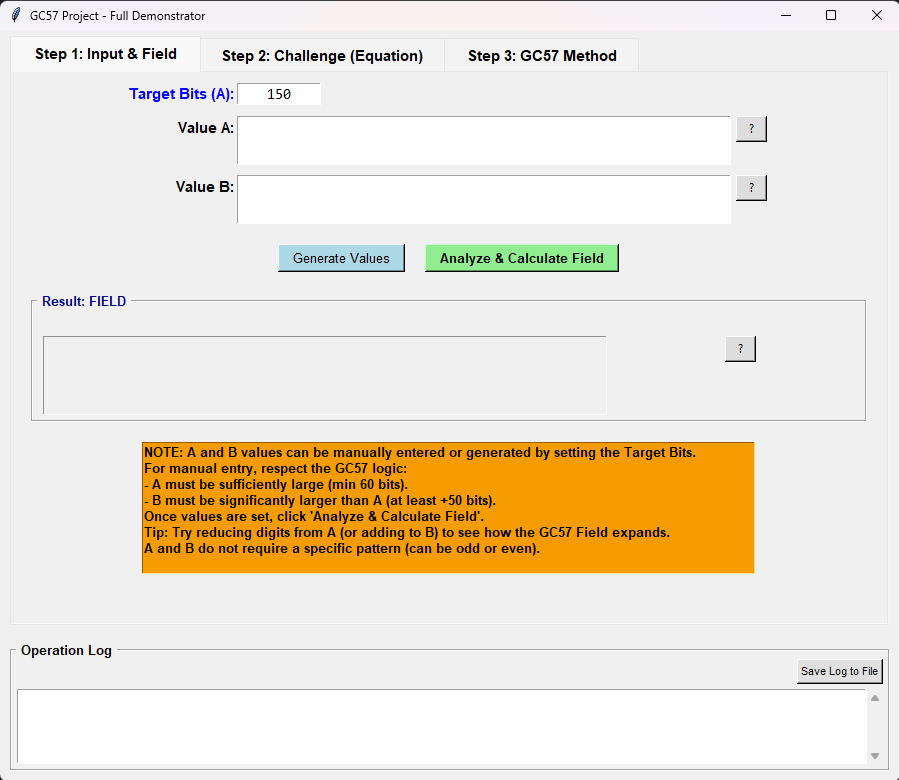
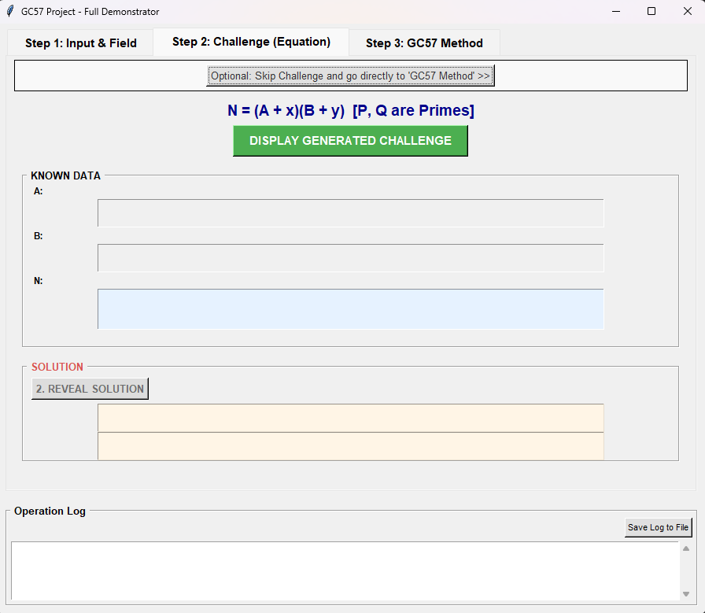
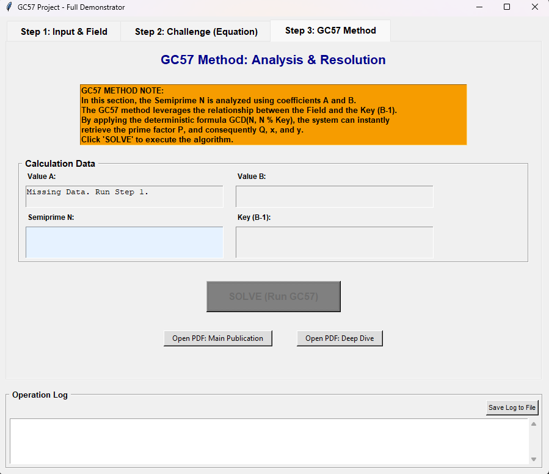

# GC57 Factorization Demonstrator

**An interactive Python demonstrator for the GC57 property regarding the deterministic factorization of Semiprimes.**

  

## 📌 Introduction

This software was created to visualize and demonstrate the **GC57 Property**, a mathematical discovery concerning the factorization of Semiprimes ($N = P \cdot Q$).
Unlike traditional probabilistic approaches, the GC57 method defines a precise geometric and arithmetic relationship between two arbitrary coefficients ($A$ and $B$) and a search "Field," transforming the factorization problem into a deterministic calculation based on a Diophantine equation.

The program allows you to:

1. Generate **Real Semiprimes** (up to 1000 bits) built from actual prime numbers.
2. Calculate the **GC57 Field** based on the distance between coefficients.
3. Solve the equation $N = (A+x)(B+y)$ instantly using the derived geometric key.

---

## 🧮 The Mathematical Principle

The method is based on identifying a finite interval, called the **Field**, calculated via the following relationship between two coefficients $A$ and $B$ (where $B > A$):

$$\text{Field} = \left( \frac{B-1}{((A + 1) \cdot (B + 1)) \bmod{(B-1)}} \right) \cdot 2$$

Within this field, factoring $N$ ceases to be a random search problem and becomes the resolution of the equation:

$$
N = (A + x)(B + y)
$$

Where $x$ and $y$ are identified deterministically by calculating the Greatest Common Divisor (GCD) with respect to the key $(B-1)$.

---

## 🚀 Software Features

The demonstrator is divided into three logical steps:

### Step 1: Input & Field Analysis

The user defines two arbitrary values, $A$ and $B$. The software calculates the "Field" size.

* **Demonstration:** You can observe how reducing the value of $A$ (increasing the distance from $B$) expands the Search Field.
* **Output:** Automatic generation of a valid Semiprime $N$ within the field.



### Step 2: The Challenge (Diophantine Equation)

A classic cryptography problem is presented:
> Given $A$, $B$, and the Semiprime $N$, can you find $x$ and $y$?

The software hides the randomly generated values and challenges the observer to solve the equation $N = (A+x)(B+y)$ using only the known data.



### Step 3: GC57 Resolution

The core of the demonstration. The software applies the GC57 algorithm.
Using the key $(B-1)$, the program executes the operation:
$$P = \text{GCD}(N, N \bmod (B-1))$$
It instantly extracts the factors $P$ and $Q$ and derives $x$ and $y$, regardless of the number's size (up to the 1000-bit limit set for portability).



---

## 🛠️ Installation and Requirements

The program is written in **pure Python** to ensure maximum transparency and portability. It does not require external calculation libraries (like `gmpy2`) to function within the 1000-bit limit.

### Requirements

* Python 3.x
* Standard libraries: `tkinter`, `secrets`, `math`, `random` (included in Python).

### Usage

The code in this folder is part of the Test-GC57 repository.

To run the test, clone the main repository and execute the script from this folder:

```bash
git clone https://github.com/Claugo/Test-GC57.git
cd Test-GC57/zenodo/deterministic_factorization_solver
python gc57_deterministic_solver.py
```

---

## 📄 Publications and References

The complete theory behind this demonstrator is documented and published on **Zenodo**:

* 📄 **Main Theory:** [DOI: 10.5281/zenodo.15640331](https://doi.org/10.5281/zenodo.15640331)
* 📄 **Deep Dive:** [DOI: 10.5281/zenodo.15742011](https://doi.org/10.5281/zenodo.15742011)
* 📄 **Relation between A and B:** [DOI: 10.5281/zenodo.15809129](https://doi.org/10.5281/zenodo.15809129)

Official project website: [www.gc57crypto.net](https://www.gc57crypto.net)

---

## 👤 Author

**Claudio Govi**

* ORCID: [0009-0005-9020-0691](https://orcid.org/0009-0005-9020-0691)
* **Research Focus:** Independent Researcher in Prime Factorization and Cryptographic Security.
